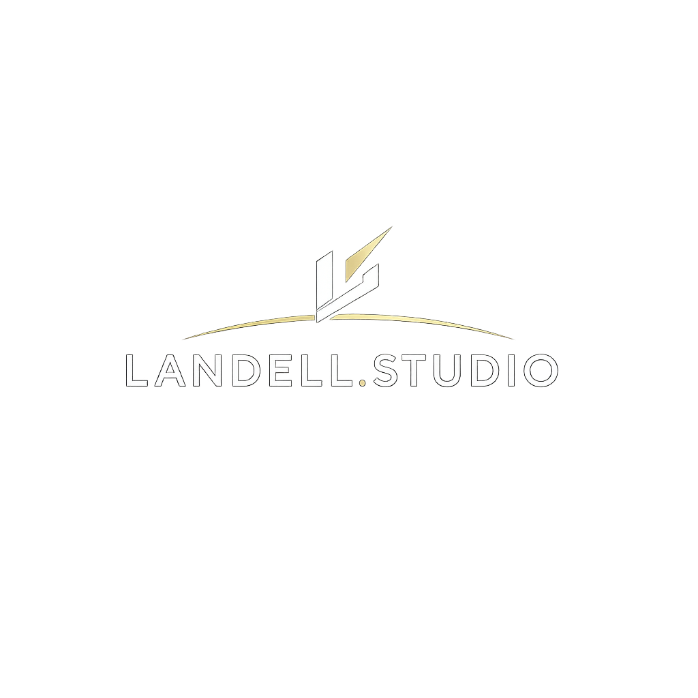

  

# Landing Page - Emilly | Landell.Studio

Este projeto é um **produto oficial e profissional**, desenvolvido sob demanda para uma cliente da área de estética.  
A landing page foi publicada e está em uso real, consolidando-se como um **case de sucesso** no portfólio da **Landell.Studio**.

---

## ✨ Características principais
- Design exclusivo com paleta **Quartz Rose + Elegant Gold**.
- Navbar translúcida e responsiva com menu hambúrguer.
- Hero section com CTA em destaque e efeito de iluminação dourada.
- Sessão "Sobre Mim" com tipografia personalizada e layout adaptável.
- Serviços apresentados em cards com borda dourada e efeito glitter animado.
- Depoimentos em carrossel interativo, com formulário responsivo para novos feedbacks.
- Rodapé elegante com logo e ícones de contato (WhatsApp e Instagram).

---

## 🚀 Tecnologias utilizadas
- [Next.js](https://nextjs.org/)  
- [React](https://react.dev/)  
- [Swiper.js](https://swiperjs.com/) para carrossel  
- CSS customizado com animações e responsividade  
- Integração com Google Sheets para coleta de depoimentos  

---

## 📦 Deploy
O projeto está publicado no **Vercel**:  
👉 [Acesse o site aqui](https://landing-emilly.vercel.app)

## 📌 Nota
Este projeto representa um **produto finalizado para cliente**, autorizado para inclusão no portfólio da **Landell.Studio**.  
É um exemplo concreto de como uma landing page bem planejada pode elevar a presença digital de um negócio.

---
